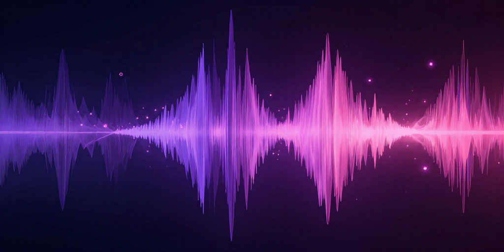
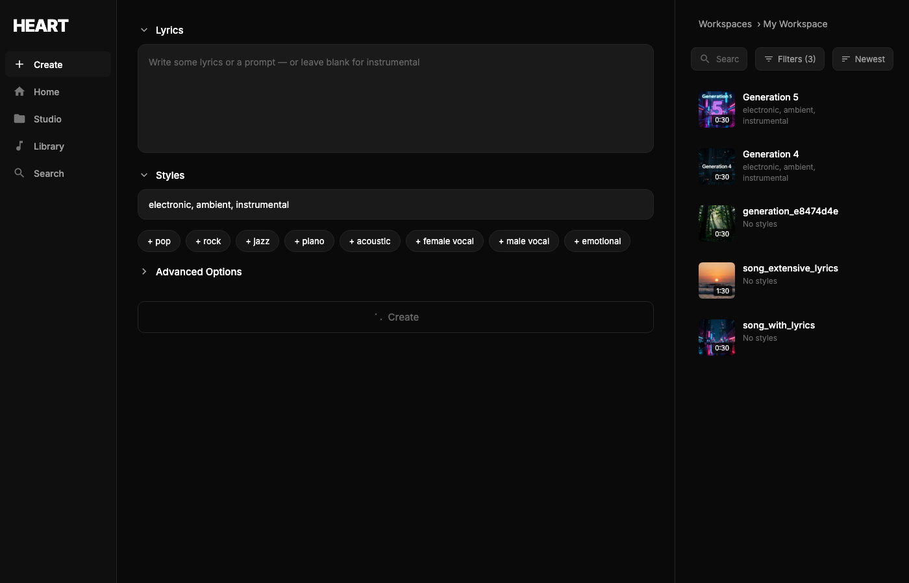
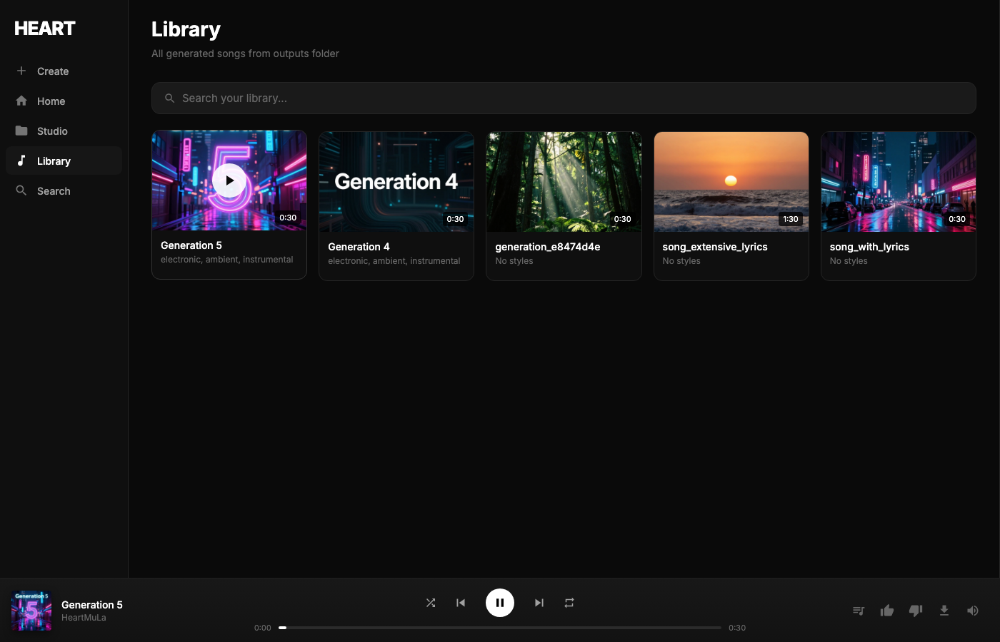

# HeartLib MLX

[](https://www.python.org/downloads/)
[](LICENSE)
[](https://github.com/ml-explore/mlx)
[](https://huggingface.co/HeartMuLa)

Apple MLX port of [HeartMuLa](https://github.com/HeartMuLa/heartlib) — open-source music foundation models achieving **comparable quality to Suno**.

**2x faster** than PyTorch MPS on Apple Silicon with optimized memory usage.

🎵 **Multilingual**: English, Chinese, Japanese, Korean, Spanish



## Features

- **Fast Generation** - 2x faster than PyTorch MPS on Apple Silicon
- **Suno-Quality Output** - 3B model with high musicality and fidelity
- **Web UI** - Modern dark-themed interface for music creation
- **AI Album Art** - Automatic cover art generation with Flux (via MFLUX)
- **Library Management** - Browse, search, and play all your generations
- **Real-time Progress** - Live updates during generation with cancel support

## Quick Start (with uv)

The fastest way to generate music - no installation required:

```bash
# Install uv if you haven't
curl -LsSf https://astral.sh/uv/install.sh | sh

# Generate music (downloads dependencies automatically)
uv run generate.py --tags "electronic, ambient" --duration 10 --output ambient.wav

# With lyrics
uv run generate.py \
  --tags "pop, acoustic, female vocal" \
  --lyrics "[verse]\nFloating through the digital sky\nWhere the stars never die" \
  --duration 20 \
  --output song.wav
```

## Installation

### Option 1: uv (Recommended)

```bash
uv sync
```

### Option 2: pip

```bash
pip install -e .
```

### Requirements

- Python >= 3.10
- Apple Silicon Mac (M1/M2/M3/M4)
- MLX >= 0.22.0
- 32GB+ unified memory recommended for full inference

## Setup

### 1. Download Weights

Download the original PyTorch weights from Hugging Face:

```bash
# Create checkpoint directory
mkdir -p ckpt

# Download HeartMuLa (3B model)
huggingface-cli download HeartMuLa/HeartMuLa-oss-3B --local-dir ckpt/HeartMuLa-oss-3B

# Download HeartCodec
huggingface-cli download HeartMuLa/HeartCodec-oss --local-dir ckpt/HeartCodec-oss

# Download tokenizer
huggingface-cli download HeartMuLa/HeartMuLa-oss-3B tokenizer.json --local-dir ckpt
```

### 2. Convert Weights

Convert PyTorch weights to MLX format:

```bash
python -m heartlib_mlx.utils.convert --src ./ckpt --dst ./ckpt-mlx
```

## Usage

### Web UI

The easiest way to generate music is through the web interface:

```bash
# Launch the web UI
uv run server.py

# Open http://localhost:8080 in your browser
```



**Features:**
- **Create** - Write lyrics, select style tags, adjust parameters
- **Library** - Browse all generated songs with album art
- **Player** - Full-featured audio player with progress, shuffle, repeat
- **AI Album Art** - Automatically generates cover art for each song
- **Cancel** - Stop generation mid-progress if needed



### Command Line

```bash
# Simple generation
python generate.py --tags "jazz, piano, instrumental" --duration 15 --output jazz.wav

# With lyrics and custom settings
python generate.py \
  --tags "rock, electric guitar" \
  --lyrics "[intro]\n\n[verse]\nRocking all night long" \
  --duration 30 \
  --cfg-scale 2.0 \
  --temperature 0.9 \
  --output rock.wav
```

### Python API

```python
from heartlib_mlx.heartmula import HeartMuLa
from heartlib_mlx.heartcodec import HeartCodec

# Load models
model = HeartMuLa.from_pretrained("./ckpt-mlx/heartmula")
codec = HeartCodec.from_pretrained("./ckpt-mlx/heartcodec")

# Generate (see generate.py for full example)
```

### Generation Options

| Option | Default | Description |
|--------|---------|-------------|
| `--tags` | electronic, ambient | Music style tags |
| `--lyrics` | (none) | Lyrics with [verse], [chorus] tags |
| `--duration` | 10 | Duration in seconds |
| `--cfg-scale` | 1.5 | Classifier-free guidance (higher = more adherence to tags) |
| `--temperature` | 1.0 | Sampling temperature (lower = more deterministic) |
| `--topk` | 50 | Top-k sampling |
| `--output` | output.wav | Output file path |
| `--dtype` | float32 | Model dtype (use `bfloat16` for ~50% less memory) |
| `--max-memory` | 32 | Memory limit in GB (generation stops if exceeded) |
| `--ignore-eos` | false | Force full duration (ignore model's end-of-song token) |

## Performance

Benchmarks on Apple M2 Max (32GB unified memory):

### MLX vs PyTorch MPS

| Metric | PyTorch MPS | MLX | Speedup |
|--------|-------------|-----|---------|
| Model Load | 7.14s | 0.82s | **8.7x faster** |
| Generation (50 frames) | 19.37s | 11.65s | **1.7x faster** |
| Audio Decode | 8.50s | 1.76s | **4.8x faster** |
| **Total** | 27.87s | 13.41s | **2.1x faster** |

### Throughput

| Framework | Frames/sec | Real-time Factor |
|-----------|------------|------------------|
| PyTorch MPS | 2.58 | 0.14x |
| MLX | 4.29 | 0.30x |

*50 frames = 4 seconds of audio at 12.5Hz frame rate*

### Memory Usage

| Component | Memory (bfloat16) |
|-----------|-------------------|
| HeartMuLa-3B | ~6GB |
| HeartCodec | ~2GB |
| KV Cache (1 min) | ~1GB |
| KV Cache (5 min) | ~5GB |
| **Total (1 min song)** | **~11GB** |
| **Total (5 min song)** | **~15GB** |

Memory is monitored during generation with Metal GPU stats:
```
[Frame 500/3750] Metal: 11.1GB | VMS: 406GB | RSS: 10.6GB | 3.6 f/s | ETA: 5.9min
```

## Architecture

### HeartMuLa

Hierarchical music language model:
- **Backbone**: LLaMA-3B (28 layers, 3072 dim, GQA with 24 heads / 8 KV heads)
- **Decoder**: LLaMA-300M (3 layers) for multi-codebook prediction
- **RoPE**: Rotary position embeddings (interleaved format)
- **CFG**: Classifier-free guidance for controllable generation

### HeartCodec

Neural audio codec operating at 12.5Hz:
- **Encoder/Decoder**: Convolutional ScalarModel
- **Quantization**: RVQ with 8 codebooks × 8192 entries
- **Flow Matching**: High-fidelity waveform synthesis with ODE solver

## Project Structure

```
heartlib-mlx/
├── app.py                   # Gradio web UI
├── generate.py              # CLI generation script (uv compatible)
├── src/heartlib_mlx/
│   ├── heartcodec/          # Neural audio codec
│   ├── heartmula/           # Music language model
│   ├── nn/                  # Custom MLX layers (RoPE, RMSNorm, etc.)
│   ├── ode/                 # Flow matching ODE solvers
│   └── utils/               # Weight conversion utilities
├── scripts/
│   └── benchmark.py         # Performance benchmarks
└── tests/                   # Parity tests
```

## Development

### Run Tests

```bash
pytest tests/
```

### Run Benchmarks

```bash
python scripts/benchmark.py --frames 100
```

### Verify Parity

The MLX implementation achieves 100% numerical parity with PyTorch:

```bash
python tests/trace_backbone.py  # Verify backbone outputs match
```

## Troubleshooting

### "Checkpoint not found"

Make sure to download and convert weights first:

```bash
# Download
huggingface-cli download HeartMuLa/HeartMuLa-oss-3B --local-dir ckpt/HeartMuLa-oss-3B
huggingface-cli download HeartMuLa/HeartCodec-oss --local-dir ckpt/HeartCodec-oss
huggingface-cli download HeartMuLa/HeartMuLa-oss-3B tokenizer.json --local-dir ckpt

# Convert
python -m heartlib_mlx.utils.convert --src ./ckpt --dst ./ckpt-mlx
```

### "Out of memory" or high memory usage

- Use `--dtype bfloat16` to halve memory usage (recommended)
- Set `--max-memory 20` to limit memory on smaller Macs
- Reduce `--duration` for shorter generations
- KV cache grows ~1GB per minute of audio
- **24GB Mac**: Up to ~3-4 minutes with bfloat16
- **32GB+ Mac**: 5+ minutes comfortably

### Generation sounds wrong

- Ensure weights are correctly converted (run `trace_backbone.py` to verify)
- Try different `--cfg-scale` values (1.0-3.0)
- Adjust `--temperature` (lower = more coherent, higher = more creative)

## Community

Join the [HeartMuLa Discord](https://discord.gg/FmHPvny9sP) for support, discussions, and sharing your creations.

## License

Apache 2.0

## Citation

```bibtex
@article{heartmula2025,
  title={HeartMuLa: A Family of Open Sourced Music Foundation Models},
  author={HeartMuLa Team},
  journal={arXiv:2601.10547},
  year={2025}
}
```

## Acknowledgments

- [HeartMuLa Team](https://github.com/HeartMuLa) for the original PyTorch implementation
- [Apple MLX Team](https://github.com/ml-explore/mlx) for the MLX framework
- [Astral](https://astral.sh) for uv package manager
